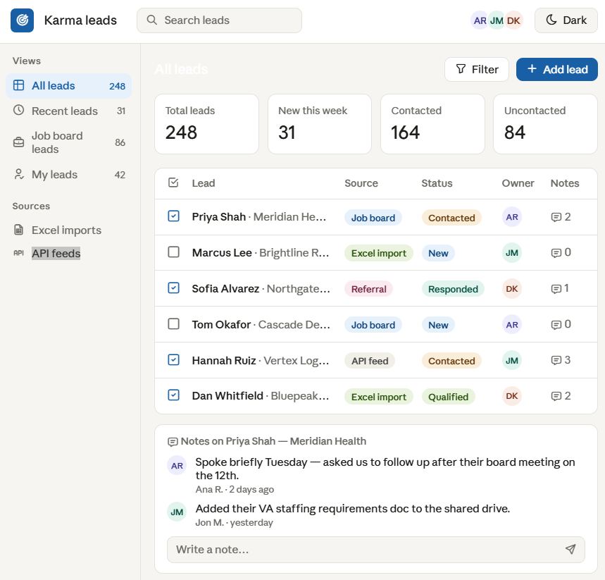

# Karma Leads

A leads dashboard for Karma Staff: ~38k restoration-industry companies, people
and job-board postings in PostgreSQL, behind a custom domain API (Node +
Express) with an email-style front end, fed by Python importers. A NocoDB
container survives as an admins-only grid.



## Layout

Everything in this repo is code. Two things it deliberately does **not** contain:

| What | Where | Why not here |
|---|---|---|
| Secrets & local data | this folder, gitignored | `.env` / `.env.server` / `apify_token.json`, the frozen `noco.db` backup and the `lead_registry.db` identity store. |
| Raw lead exports | `…\OneDrive\Documents\GitHub\KarmaLeads\` | Real names, phone numbers, emails and a do-not-call list. Stays out of git, keeps its OneDrive backup. |

```
server/               the domain API on :8080 — auth (WorkOS), leads, counts,
                      recents, users, activity, job search, imports, migrations
migrations/           plain SQL, applied by `node server/migrate.js` —
                      the ONLY way the schema changes
public/               the front end: app.js (vanilla SPA), app.css, index.html
dashboard/
  sync.py             the everyday refresh from the source files
  import_dnc.py       bulk do-not-call application
  setup_and_import.py the source-file parsers (collect())
  setup_v2.py         the clustering + franchise guards (sibling of server/dedupe.js)
  registry.py         Lead Code identity store (SQLite, beside the repo)
  domain_api.py       how the pipeline talks to the API (service token)
  README.md           team-facing guide
  how-it-works.html   illustrated architecture walkthrough + timeline
scripts/etl-from-noco.js  the one-off SQLite→Postgres migration (recovery path)
docker-compose.yml    dev: postgres + the NocoDB admin container
CLAUDE.md             working notes: design decisions, gotchas, known data issues
```

## Running it

```bash
docker compose up -d       # postgres + the NocoDB admin container
node server/migrate.js     # apply pending migrations
node server/index.js       # or start-dashboard.bat for all of the above
```

- `http://localhost:8080/app` — the team UI (sign-in via WorkOS)
- `http://localhost:8082/dashboard` — the NocoDB admin grid (admins only)

There is no build step, no test suite and no linter. The front end is plain
HTML/CSS/JS — edit `public\` and refresh. When you change markup and script
together, bump the `?v=N` on `app.js` / `app.css` in `index.html`, or a browser
that mixes an old file with a new one renders a blank page.

## First-time setup

Copy `.env.example` into `.env` and `.env.server` and fill them in (compose
passwords, `DATABASE_URL`, the WorkOS keys). The Apify token for the job
search goes in `apify_token.json` (see its `.example.json`) or `APIFY_TOKEN`.
Then `npm install`, and point `KARMA_LEADS_DATA` at the folder holding the raw
exports if it is not at the default path in `dashboard/setup_and_import.py`.

The Python pipeline authenticates with a service token:
`node server/cli.js token:create pipeline imports:write`, then set
`KARMA_API_URL` / `KARMA_API_TOKEN` in its environment.

## Importing leads

There is no destructive rebuild any more. New files go through the app's
import drop zone (admins) or the pipeline:

```bash
python dashboard/sync.py --dry-run   # always first; prints the plan
python dashboard/sync.py
```

See `CLAUDE.md` for the full pipeline and the list of things that will bite you.
